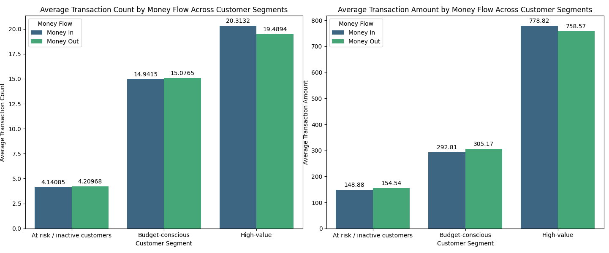

# **Key Insights**

## **Distribution of NPS categories across customer segments**

**Key insights:**

- **High-value** customers have the highest proportion of promoters, indicating strong brand loyalty and satisfaction. However, some customers may have unmet expectations or issues that need addressing.

- **Budget-conscious** customers have a notable share of promoters, indicating moderate satisfaction. However, there is a slightly higher proportion of detractors among budget-conscious customers compared to at-risk/inactive customers, indicating possible financial strains or other pressures influencing their perception of the brand.

- **At-risk/inactive** customers have the lowest proportion of promoters, suggesting overall disengagement. They also have the highest proportion of passives, which may imply that they are undecided and could potentially be swayed with the right interventions, or are simply unengaged due to irrelevant product offerings or communication.

## **Financial health across customer segments**

### **Correlation matrix for financial health metrics**

**Key insights:**

Financial health correlations:
Higher income and savings (`log_income` and `log_balance`) strongly correlate with improved financial metrics like `balance_to_debt`, while rising debt (`log_debt`) increases `debt_to_income` ratios. The near-perfect correlation between `log_balance` and `balance_to_debt` underscores that savings are a key lever for managing debt.

Segment differentiation and business implications:

- Customers with robust income and savings typically exhibit stronger financial stability, indicating **high-value** segments that can be nurtured for upselling and cross-selling opportunities.

- Customers with lower income and savings, and often showing higher debt burdens, may represent **budget-conscious** segments that could benefit from targeted financial wellness support.

- Patterns of rising debt and financial instability may help flag **at-risk** segments, suggesting the need for re-engagement strategies to improve their financial health and overall loyalty.

### **Boxplots of 'debt-to-income' ratio and 'balance-to-debt' ratio by customer segment**

**Key insights:**

- **High-value** customers have a generally lower and more stable debt-to-income (DTI) ratio, indicating better financial management and lower reliance on debt. The positive balance-to-debt ratio with minimal variation suggests strong financial health and likely savings.

- **Budget-conscious** customers have a generally moderate DTI ratio with some extreme outliers, suggesting potential financial strain for a subset. The higher balance-to-debt ratio indicates relatively higher balances compared to their debt. However, many outliers show negative ratios, possibly indicating account overdrafts or defaults.

- **At-risk** customers show a broad variation of DTI ratio, with a few outliers and a median similar to budget-conscious customers, suggesting inconsistent financial stability within the group. There is a significant variation in balance-to-debt ratio, with a large proportion having negative ratios, signaling potential financial distress.

### **Barplot of the proportion of customers with on-time loan payments for each segment**

**Key insights:**

- **High-value** customers exhibit the highest on-time payment rate, indicating strong financial reliability and stability. This suggests they are ideal candidates for premium offers (e.g. lower interest rates, exclusive credit lines) to reinforce loyalty.

- **Budget-conscious** customers have the lowest on-time payment rate, likely due to cash flow sensitivity. They may benefit from support measures like flexible repayment plans, automated reminders, or budgeting tools to further improve payment outcomes.

- **At-risk/inactive** customers show a moderate on-time payment rate, implying their "risk" may stem from inactivity (e.g. low engagement with other bank services) rather than payment defaults. Proactive re-engagement strategies (e.g. personalized incentives, reactivation campaigns) could improve retention.

The differences in payment behaviour across customer segments are relatively small, suggesting that overall payment reliability is not the key differentiator between segments.

### **Stacked bar chart for the percentage distribution of loan categories within each segment**

**Key insights:**

- **High-value customers** have the highest asset acquisition, business and education loans, and the lowest debt management loans, indicating a focus on investments and aligning with their financial stability.

- **Budget-conscious** customers show high debt Management loans, signaling potential financial stress or reliance on loans to manage existing obligations. Significant credit product usage suggests they may use credit to bridge cash flow gaps.

- **At-risk/inactive** customers have the highest debt management loans, indicating severe financial strain, which likely contributes to their "at-risk" status.

## **Product usage across customer segments**

### **Barplot of product usage proportions by customer segment**

**Key insights:**

- **High-value** customers show dominance in premium products with the highest adoption of investment products, credit cards, fixed deposits, and insurance. 

- **Budget-conscious** customers show moderate adoption of core products such as credit cards and insurance, but investment products lag behind high-value. There is also low fixed deposit usage, suggesting limited savings capacity.

- **At-risk/inactive** customers show low engagement with the bank products.

The chi-square tests validate that customer segments exhibit distinct financial behaviours, enabling highly targeted and data-driven marketing strategies.

## **Transaction history across customer segments**

### **Barplot of the average transaction count and value by customer segment**

### **Barplot of transaction amount and count for money flow across segments**

### **Summary of key insights:**

- **High-value** customers lead in transaction frequency and value, indicating frequent and high-value financial activities (e.g. investments, large purchases). Combined with their net depositor status (strong cash inflow) and premium product dominance, this reflects wealth-building behaviour.

- **Budget-conscious** customers show moderate transaction frequency and value, indicating cautious spending. This aligns with their net spender status (higher cash outflow) and reliance on core products. However, they account for the largest share of the bank’s overall transaction volume, making them a key segment for engagement efforts, as targeted support could significantly impact overall transaction activity and customer retention.

- **At-risk** customers exhibit the lowest transaction frequency, value, and activity, indicating low engagement rate. Targeted re-engagement efforts, such as tailored product offers or personalized outreach, may help to boost their activity and retention.

## **Digital engagement across customer segments**

### **Barplot of the mobile and web engagement rate for each customer segment**

### **Boxplot of mobile and web engagement ratio across customer segments**

### **Summary of key insights:**

- **High-value** customers have the highest mobile app adoption and mobile-web ratio, indicating a strong preference for mobile platforms. 

- **Budget-conscious** customers have moderate engagement but include inactive users requiring re-engagement. 

- **At-risk/inactive** customers have the lowest mobile app and web account usage, signaling limited digital interaction.

# **Targeted marketing approaches for each customer segment**

##### **1. High-value Customers**

**Key Characteristics:**  
- **High Loyalty:** High percentage of promoters and on-time loan payments  
- **Strong Financial Health:** Lower debt-to-income ratios and high balance-to-debt ratios
- **Premium Product Behaviour:** High adoption of investment products, fixed deposits, insurance, and credit cards 
- **Active Digital Engagement:** High mobile app adoption and high transaction values and frequency

**Targeted Marketing Approaches:**  
- **Retention & Loyalty Programmes:**  
  - Offer exclusive rewards, premium services, and personalized offers (e.g. tailored wealth management bundles, investment + insurance packages)
  - Develop loyalty initiatives that include benefits like cashback on large transactions and bonus interest rates on deposits

- **Upsell Premium Financial Services:**  
  - Promote wealth management services such as high-yield savings, portfolio diversification, and asset-backed loans
  - Leverage their digital engagement by offering advanced mobile app features (e.g. AI-driven insights, instant investment alerts)

- **Proactive Engagement:**  
  - Use personalized push notifications and tailored mobile alerts to highlight exclusive offers and upcoming premium products

#### **2. Budget-Conscious Customers**

**Key Characteristics:**  
- **Mixed Satisfaction:** Moderate number of promoters and detractors
- **Financial Constraints:** Moderate debt-to-income ratios with some outliers and higher instances of debt management usage
- **Core Product Reliance:** Frequent use of credit cards and insurance but lower engagement with savings products like fixed deposits
- **Cautious Transaction Behaviour:** Fewer and lower-value transactions on average with a net spending profile  
- **Digital Challenges:** Moderate mobile adoption but highest observed inactivity among digital users

**Targeted Marketing Approaches:**  
- **Value-Driven Financial Solutions:**  
  - Introduce cost-effective value propositions like micro-investment platforms and low-entry fixed deposits to encourage savings
  - Roll out debt relief programmes, debt consolidation options, and refinancing offers to alleviate debt stress

- **Educational & Financial Wellness Programmes:**  
  - Offer content and workshops on debt management, budgeting tools, and financial literacy 
  - Provide automated savings tools to help transition spending to saving

- **Digital Engagement Incentives:**  
  - Launch app onboarding campaigns with incentives (e.g. cash rewards for first login or bill-payment discounts)  
  - Simplify app user experience with guided tutorials and educational content that address everyday financial needs

#### **3. At-Risk/Inactive Customers**

**Key Characteristics:**  
- **High Dissatisfaction:** Lowest promoter scores and highest percentage of detractors, reflecting disengagement 
- **Financial Stress:** High debt management usage, significant negative balance-to-debt ratios, and inconsistent financial stability
- **Loan Dependence:** Higher reliance on debt management and miscellaneous borrowing, indicating emergency-driven needs  
- **Low Transactional Activity:** Lowest average transaction frequency and value with a net spending profile
- **Digital Disengagement:** Lowest mobile adoption and overall lower digital interaction

**Targeted Marketing Approaches:**  
- **Reactivation & Outreach Campaigns:**  
  - Develop personalized re-engagement initiatives such as targeted emails, SMS reminders, and one-on-one consultations to understand their needs
  - Offer exclusive reactivation incentives like small, short-term loans or debt consolidation programmes to rebuild trust

- **Tailored Debt & Financial Recovery Solutions:**  
  - Introduce debt restructuring, credit counseling, and hardship programmes to address their acute financial challenges 
  - Provide low-risk digital products (e.g. secured credit cards, small fixed deposit options) to gently reintroduce them to the bank’s services

- **Simplify and Support Digital Adoption:**  
  - Run digital re-engagement campaigns with step-by-step guides for using mobile apps, along with perks such as fee waivers for app-based balance checks
  - Create a simplified, user-friendly digital interface to reduce friction and build confidence in digital banking