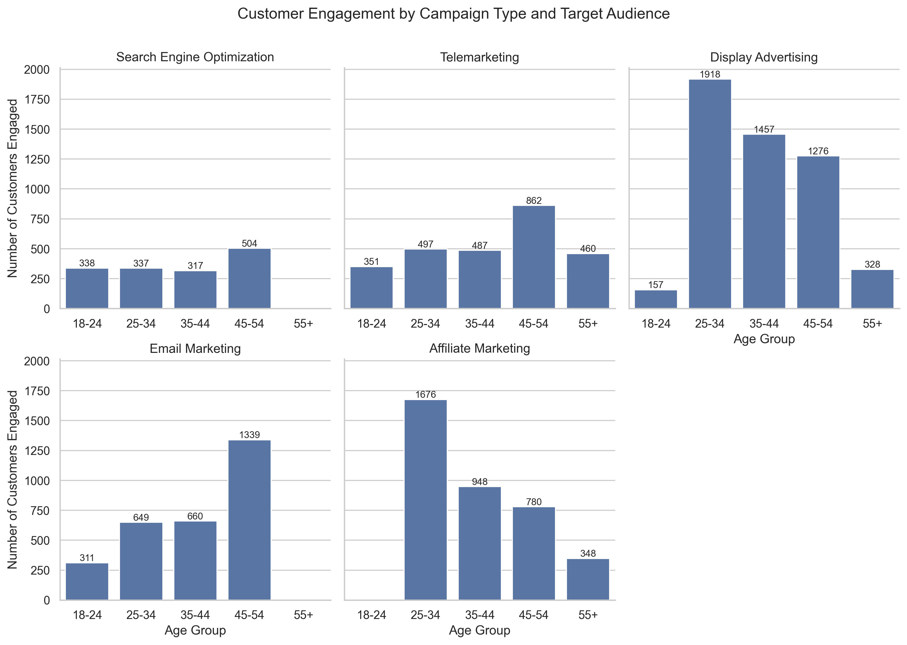
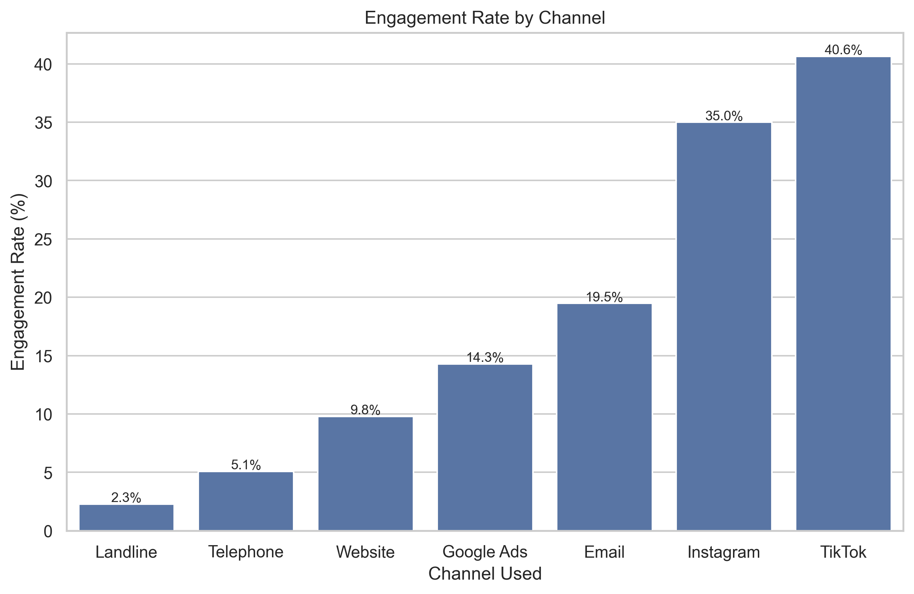
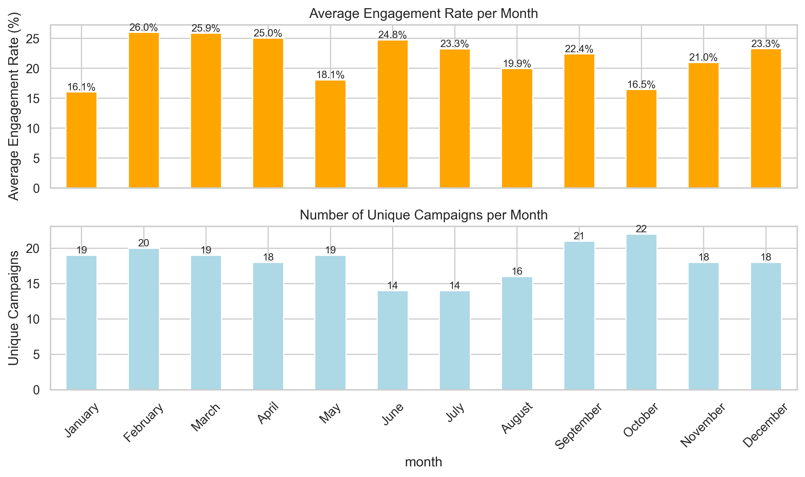
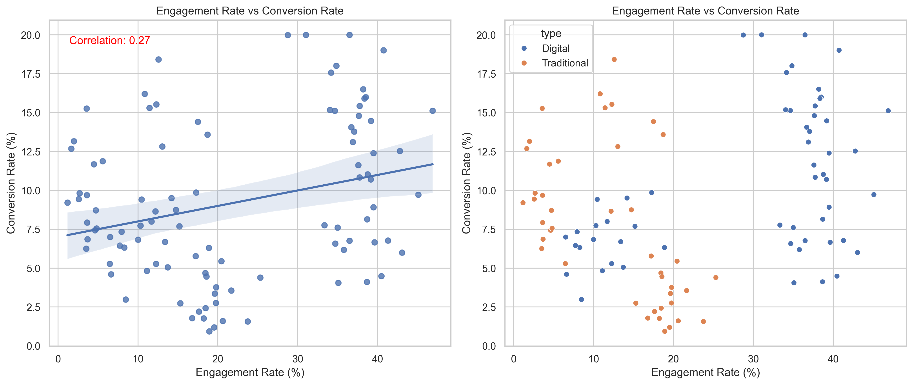
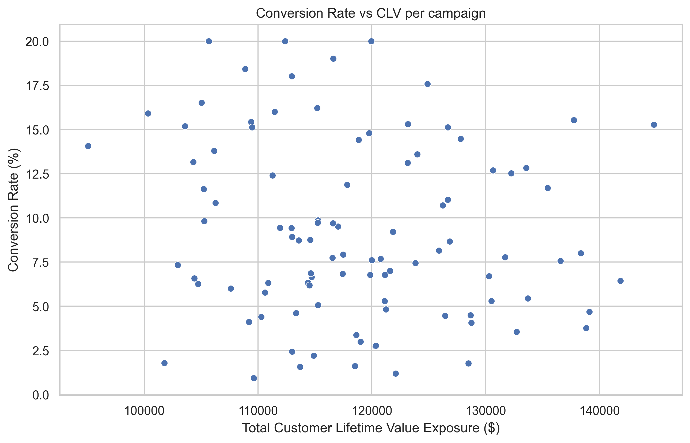
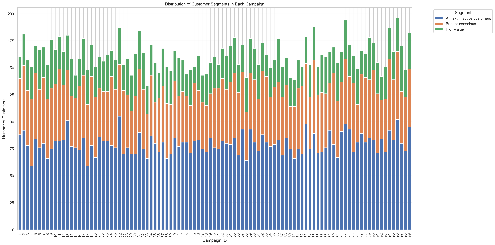

# Campaign Impact Analysis

The bank is currently struggling with low engagement from its marketing campaigns, even though they possess extensive customer data. Given this situation, the bank requires a marketing strategy that focuses on awareness campaigns: introducing the brand and products to as many new audiences as possible. Through analysis, we will derive actionable insights on how the existing marketing strategies can be improved.

## Key Performance Indicators (KPIs)

To evaluate the success of our marketing campaigns, we focus on the following KPIs:

1. **Reach**: Measures the number of unique customers exposed to the campaign.
   - **Business Outcome**: Higher reach increases brand awareness and market share.

2. **Engagement Rate**: Percentage of engagement attempts resulting in successful interactions.
   - **Business Outcome**: Higher engagement rates strengthen customer relationships and retention.

3. **Conversion Rate**: Percentage of engaged customers who take the desired action.
   - **Business Outcome**: Higher conversion rates drive revenue and profitability.

4. **Customer Lifetime Value (CLV)**: Total worth of a customer over their relationship with the bank.
   - **Business Outcome**: Targeting high-CLV customers boosts long-term profitability.

---

## Analysis and Insights

### Reach

We analyzed customer engagement by campaign type and target audience. The visualization below highlights the distribution of customers engaged across different campaign types and target audiences:

**Insight**: Engagement efforts often misalign with campaign goals, with 60%-90% of engagements targeting the wrong age group.  
**Action**: Coordinate engagement efforts to focus on the intended target audience.

---

### Engagement Rate

#### Overall Engagement Rate
The overall engagement rate is approximately 20%.

#### Engagement Rate by Channel
The engagement rate varies significantly by communication channel, as shown below:

**Insight**: Digital channels, such as TikTok and Instagram, perform better (~40%) compared to traditional channels like telemarketing (<5%).  
**Action**: Allocate more resources to high-performing digital channels.

#### Engagement Rate by Month
The following visualization shows engagement rates and the number of campaigns per month:

**Insight**: June has the highest engagement rate despite fewer campaigns, while October has the most campaigns but the lowest engagement rate.  
**Action**: Shift campaigns to periods of high engagement to maximize effectiveness.

---

### Conversion Rate and CLV

#### Engagement vs Conversion Rate
The scatter plot below shows a weak positive correlation between engagement and conversion rates:

**Insight**: Digital campaigns generally outperform traditional campaigns in conversion rates.  
**Action**: Focus on optimizing digital campaigns for higher conversions.

#### Conversion Rate vs CLV
The relationship between conversion rate and total CLV exposure per campaign is visualized below:

**Insight**: Current targeting strategies are not effectively converting high-value customers.  
**Action**: Refine targeting to prioritize high-CLV customers.

---

### Customer Segment Distribution

The distribution of customer segments across campaigns is shown below:

**Insight**: Campaigns are not specialized enough to target specific customer segments effectively.  
**Action**: Organize specialized campaigns, such as retention campaigns for inactive customers and loyalty campaigns for high-value customers.

---

## Summary

- **Key KPIs**: Focus on reach, engagement rate, and conversion rate to evaluate campaign success.
- **Alignment**: Ensure engagement efforts align with campaign objectives.
- **Seasonality**: Optimize campaign scheduling based on engagement trends.
- **Specialization**: Develop campaigns tailored to specific customer segments.

**Business Outcomes**: By aligning KPIs with business goals, such as increased revenue, market share, and customer retention, we can ensure measurable value from marketing strategies.
