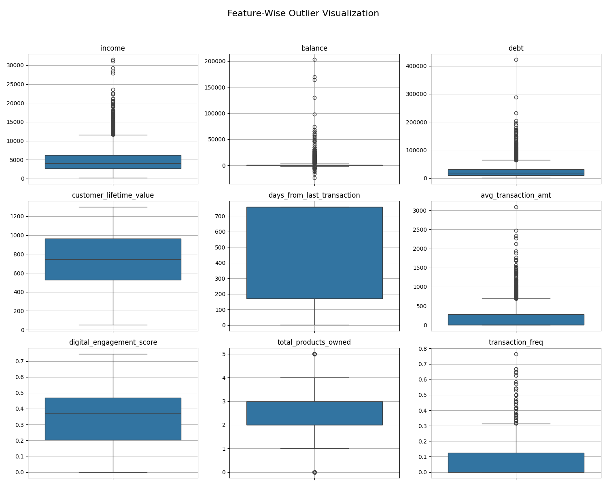
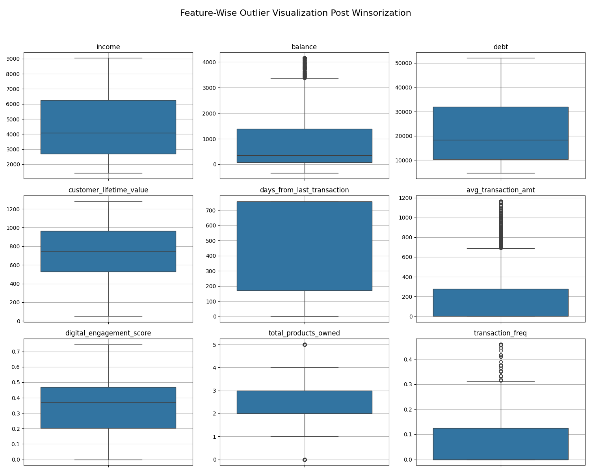

# Customer Segmentation

## Problem Statement

How can we effectively segment customers by uncovering patterns in their banking behavior and preferences through transaction data analysis, in order to tailor services and enhance engagement across diverse customer profiles?

---

## Business Segments

| Segment                    | Behaviour                                                                       |
|---------------------------|----------------------------------------------------------------------------------|
| High-value                | Frequent transactions, high balance, high income, engaged in digital banking    |
| Budget-conscious          | Lower balance, lower transaction frequency, avoids unnecessary fees/services    |
| At risk / inactive        | Minimal or no recent transactions, high churn risk                              |

---

## Data Preparation Summary

### Datasets Used
- `customer.csv`: Demographics & financials (CLV, income, debt, etc.)
    1. **Customer Lifetime Value (CLV)**  
        - Reflects the long-term profitability of the customer.

        - Higher CLV often indicates a loyal, engaged customer who is likely to generate more revenue over time.

    2. **Income**  
        - Suggests spending potential.

        - Higher income customers might qualify for premium products or services.

    3. **Debt**  
        - High debt may indicate financial strain or credit risk, which may affect product suitability and churn likelihood.

    4. **Balance**  
        - Can be used to reflect for account activity and wealth.

        - Consistently high balances often signal engagement and financial stability.

- `digital_usage.csv`: Digital login/session behavior
    1. **has_mobile_app / has_web_account**

        - Binary indicators of whether the customer is digitally onboarded.

        - Useful for basic segmentation: digitally engaged vs not.

    2. **mobile_logins_wk / web_logins_wk**

        - Show how frequently customers access digital platforms.

- `transactions.csv`: Transaction frequency and monetary value
    1. **transaction_amt**  
    - Helps quantify activity level.

    - You can calculate average transaction amounts per customer.

    3. **transaction_date**  
        - Enables behaviour analysis:

        - Frequency of transactions

        - Recency (last activity date)

- `products_owned.csv`: Number of products customer has with the bank
        - All the columns can give us an idea on the customer's engagment because we can use all the columns to calculate the count of products the customer owns.

---

## Feature Engineering

### Transaction Table
To capture customer activity, two key interaction terms were created:
- **Days Since Last Transaction**: This was calculated using the most recent transaction date per customer, relative to a reference date (1 Jan 2025). It reflects how recently a customer engaged with the bank.
- **Average Transaction Amount**: Total transaction value divided by the number of transactions per customer. Missing values and division by zero were handled gracefully.

### Digital Usage Table
To quantify digital engagement:
- A **Digital Engagement Score** was created by combining mobile and web login frequencies (70% weight) and average session durations (30% weight).
- All components were normalized before aggregation.

### Products Table
- Calculated the **Total Number of Products Owned** per customer by summing across product columns. This measures relationship depth with the bank.

### Customer Table
- Selected relevant attributes: income, balance, debt, CLV, tenure, and default status.

### Derived Features
- **Transaction Frequency**: Computed as number of transactions divided by capped tenure (max 24 months) to ensure fairness.

### Merging Datasets
All tables were merged on `customer_id` to form a unified DataFrame for analysis.

---

## Missing Value Handling
- **Digital engagement score**: Imputed with the column mean.
- **Transaction-related features**: If no transaction record, all were set to zero (i.e., no activity assumed).
- **Recency (days_from_last_transaction)**: For missing cases, we assigned a high but reasonable value — the current maximum plus a 30-day buffer — to reflect customer inactivity without skewing scale.

---

## Outlier Treatment & Scaling

### Outlier Visualization (Before Winsorization)

To prepare features for clustering, we first applied **winsorization** to cap extreme outliers.

- Features like `customer_lifetime_value`, `avg_transaction_amt`, and `transaction_freq` were less skewed, so we applied **1% winsorization** (limits = `[0.0, 0.01]`).
- Wealth-related features like `income`, `balance`, and `debt` were more skewed, so we applied a stronger **10% winsorization** to reduce the influence of extreme values (limits = `[0.05, 0.1]`).

After capping outliers, we applied two types of scaling:

1. **RobustScaler** for `robust_features`  
   This scaler centers the median at 0 and scales based on the interquartile range (IQR), making it less sensitive to outliers than StandardScaler. It's ideal for features with residual skew even after winsorization.

2. **StandardScaler** for `standard_features`  
   This scales data to have a mean of 0 and a standard deviation of 1. It's used on features like `days_from_last_transaction`, `digital_engagement_score`, and `total_products_owned`, which are more normally distributed and less impacted by outliers.

This preprocessing ensures fair feature contribution to the clustering algorithm.
- **RobustScaler** used on skewed financial features (e.g., income, CLV, debt) to mitigate outlier influence.
- **StandardScaler** used on features like recency, digital engagement, and products owned which were more normally distributed.

### Outlier Visualization (After Winsorization)

---

## PCA Analysis

This code performs Principal Component Analysis (PCA) to analyze how much variance each feature contributes to the dataset. The `explained_variance_ratio_` measures how much variance each principal component captures.
- This validated the relevance of key features.

---

## Clustering

### K-Means Clustering
- We used `k=3` based on business understanding of three key customer profiles.
- Evaluation via Silhouette Score (~0.2429) indicated moderate overlap — typical for real-world behavioral data.

Silhouette Score is quite low (0.2429 ≤ 0.3), indicating that while the segments have meaningful distinctions, there is moderate overlap between customer groups. Customer data typically includes heterogeneous characteristics (e.g., behavioral, transactional, demographic attributes) that naturally reduce clear separations between segments. In real-world customer data, behaviors tend to exist on a spectrum rather than in cleanly separable groups which can explain the lower score. However, the segments are designed based on business logic (engagement, spending, product usage), so the clustering still offers useful segmentation, even if silhouette metrics aren't exceptionally high.

### Cluster Labels

To assign meaningful segment labels, we used a **weighted scoring system** based on the importance of each feature in indicating customer value.

#### Positive Contribution Features
These features increase the likelihood of a customer being high-value:

| Feature                    | Weight | Rationale                                              |
|---------------------------|--------|---------------------------------------------------------|
| `income`                  | 10%    | Indicates financial health                              |
| `balance`                 | 10%    | Reflects stability and saving behavior                  |
| `customer_lifetime_value`| 15%    | Long-term revenue predictor                             |
| `avg_transaction_amt`     | 20%    | Higher spend per transaction indicates engagement       |
| `digital_engagement_score`| 20%    | Strong indicator of ongoing digital relationship        |
| `total_products_owned`    | 20%    | Reflects breadth of customer relationship               |
| `transaction_freq`        | 20%    | More transactions signal more activity and interest     |

#### Negative Contribution Features
These reduce the score and indicate potential risk:

| Feature                     | Weight | Rationale                                       |
|----------------------------|--------|--------------------------------------------------|
| `days_from_last_transaction` | -20%  | More inactivity implies disengagement            |
| `debt`                     | -5%    | High debt may signal financial stress or risk    |

#### Segment Assignment Logic

Clusters are ranked based on their total weighted score:
- **Top cluster** → High-Value
- **Second** → Budget-Conscious
- **Lowest** → At Risk / Inactive
We designed a weighted scoring system using normalized cluster means:
- Positively weighted: income, balance, CLV, avg transaction amount, digital engagement score, products owned, transaction frequency
- Negatively weighted: days since last transaction (inactivity) and debt (risk)

### Final Segment Mapping
- Cluster with highest score: High-value
- Second highest: Budget-conscious
- Lowest: At risk / inactive

---

## Segment Insights (Aggregated Means)

Segment-wise behavior patterns were confirmed post-clustering:
- **High-value**: High transaction amounts, high CLV, balance and income, and broad product ownership
- **Budget-conscious**: Moderate activity, fewer products owned, lower income and balance
- **At risk**: Lowest average transaction amount and frequence, most days since last transaction suggesting low engagement, lowest digital usage and engagement
  ### Segment-wise Mean of Key Features

| Segment                     | Income   | Balance | Debt     | CLV    | Days Since Last Txn | Avg Txn Amt | Digital Engagement  | Products Owned | Txn Frequency  |
|----------------------------|----------|---------|----------|---------|---------------------|-------------|---------------------|----------------|----------------|
| **At risk / inactive**     | 3794.34  | 443.85  | 23332.20 | 680.92  | 744.61              | 13.01       | 0.3191              | 2.33           | 0.0043         |
| **Budget-conscious**       | 3730.14  | 391.18  | 21980.71 | 691.96  | 167.05              | 281.22      | 0.3410              | 2.30           | 0.1521         |
| **High-value**             | 8530.00  | 3575.02 | 22009.61 | 940.17  | 440.61              | 393.41      | 0.3373              | 2.90           | 0.1003         |

---

## Business Application

Segmenting customers this way allows straightforward analysis of behaviour within groups where customers exhibit similar behavioural patterns. It enables us to effectively detect segment-specific behavioural trends and allows us to make informed decision-making regarding interventions targeted at each segment.
