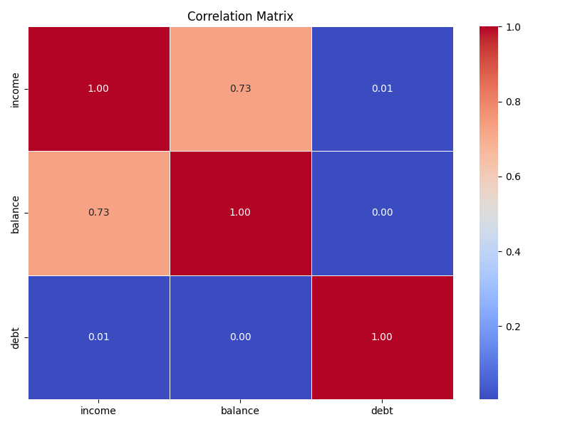

# Predicting Customer Preferences
This report presents a data-driven approach to predicting customer preferences for banking products, using financial, demographic, and behavioral attributes to inform personalized recommendations. It provides comprehensive details on data sources, methods, feature engineering, modeling strategies, evaluation techniques, and interpretation of results used for predicting customer product preferences.

### Table of Contents
1. Problem Analysis
2. Exploratory Data Analysis (EDA)
3. Model Selection and Training
4. Model Results and Interpretation
5. Key Recommendations

---

## 1. Problem Analysis 
Understanding and predicting customer preferences is essential for tailoring banks' marketing efforts and driving higher customer engagement. Banks face challenges in determining the most relevant products for individual customers, especially when customer needs and preferences are influenced by numerous variables such as income, loan behaviour, and customer demographics. Predicting these preferences allows banks to provide personalized recommendations, improving customer satisfaction and fostering long-term relationships.

To address this challenge, we aim to develop a model that predicts individual customer preferences for banking products based on customer financial attributes such as income and debt, demographic features such as age, marital status, and education level, and loan details, to get context about a customer’s current and future financial commitments. Additionally, we will incorporate the results from customer segmentation to fine-tune the model’s predictions for specific customer groups. The model will be designed as a multi-label classification problem, where multiple products can be recommended for each customer based on their unique characteristics.

--- 

## 2. Exploratory Data Analysis

### Feature Correlation Analysis

To evaluate potential redundancy among financial-related features, we perform correlation analysis on customers' income, balance, and debt. This analysis ensures that selected features provide distinct insights and informs our feature selection.

- **High Correlation between Income and Balance (0.73):**  
    The correlation analysis identified a strong positive correlation (0.73) between the features `income` and `balance`. Since both features represent similar aspects of a customer's financial capability, retaining both could lead to feature redundancy. Furthermore, `balance` exhibited relatively low feature importance in predicting customer preferences during model training. Thus, we opted to remove `balance` to simplify the model without sacrificing predictive power or interpretability.

- **Low Correlation of Debt with Income and Balance:**  
  The `debt` feature exhibited negligible correlation with both income and balance, suggesting it provides unique financial information relevant to predicting customer preferences.

### Categorical Feature Distributions

The categorical feature distributions were analyzed to identify potential imbalances that could impact predictive model performance.

- **Significant Class Imbalance in default:**  
  The `default` feature is highly imbalanced, with a dominant majority of customers categorized as non-defaulters (default=0). Such an imbalance might bias model predictions, especially by underrepresenting minority classes.
  Upon analysis of the correlation between `default` and target variables (product ownership), we uncovered that the correlations were very weak—close to zero, indicating that `default` does not significantly contribute useful predictive information regarding customer product preferences. It was hence excluded from the predictive model.

### Relationship between Product Ownership and Active Loans

To assess the predictive value of loan-related data, we aggregated multiple loan features—including total loan amount, average loan amount, and a binary indicator (`has_active_loan`)—and visualized their relationships with product ownership. Among these aggregated features, only `has_active_loan` demonstrated meaningful patterns with product ownership.

- Customers with **active loans** exhibit notably higher ownership rates across several financial products (investment products, credit cards, fixed deposits, and insurance), suggesting these customers are generally more financially engaged.

- Particularly strong relationships emerged between active loan status and the ownership of **credit card** and **fixed deposit** products, highlighting potential cross-selling opportunities.

Given these insights, the binary feature `has_active_loan` was retained as a valuable predictor, while other aggregated loan features (total loan amount, average loan amount) were excluded due to their lack of meaningful relationships with product ownership.

### Product Ownership Distribution

Analyzing the distribution of product ownership helps us understand class balance, directly influencing model selection and data handling strategies.

**Key Observations:**

- **Credit cards, fixed deposits, and investment products** show approximately **70% positive ("yes") cases**, indicating a moderate class imbalance favoring product ownership.

- Conversely, **insurance products** have notably lower positive cases (around **40% positive**), representing a significantly different distribution compared to the other three products.

**Implications for Modeling:**

Given the observed imbalance, we plan to leverage tree-based models—specifically, **Random Forest and XGBoost**—due to their robustness in handling imbalanced datasets. Furthermore, to enhance predictive accuracy, we will implement tailored **class weighting** strategies by applying distinct class weights per product. This ensures the model accurately learns from each specific ownership distribution.

--- 

## 3. Model Selection and Training

After testing out **Random Forest** and **XGBoost** models, **XGBoost** seemed to handle the class imbalance better and predict with higher accuracy.

### Evaluation Metrics:

In addition to accuracy, model performance was assessed primarily using two metrics:

- **Recall**: Maximizing recall is crucial for ensuring that as many interested customers as possible are identified, thus minimizing missed lead opportunities.

- **F1-Score**: The F1-score provides a balanced measure by considering both recall and precision, helping prevent overly broad recommendations that could negatively affect customer experience.

### Performance:

The table below summarizes the cross-validated performance metrics obtained with the XGBoost model:

| Product                  | Average Recall | Average F1-Score | Average Accuracy |
|--------------------------|----------------|------------------|------------------|
| Investment Product       | 98%          | 79%            | 65%            |
| Credit Card              | 91%          | 83%            | 76%            |
| Fixed Deposit            | 98%          | 79%            | 65%            |
| Insurance                | 81%          | 68%            | 66%            |

**Insights from Performance Results:**

- High recall scores across products suggest strong performance in capturing potential leads or customers, especially for Investment Products and Fixed Deposits.

- Credit Cards showed strong balance between recall and precision, resulting in a higher F1-score, indicative of good predictive balance.

- Insurance, while performing slightly lower compared to other products, still demonstrates reasonable recall and F1 scores, given its relatively lower rates of customer ownership.

Overall, the model is a strong fit, and customer preferences can be accurately predicted.

## 4. Model Results and Interpretation

After selecting XGBoost as the final model, we analyzed feature importance to understand which variables most influenced product ownership predictions. The tables below present the top three most influential features for each product, along with their relative importance scores.
- Although random seeds were set where possible, due to the inherent non-determinism in XGBoost (e.g., from parallel processing), reruns may result in slight variations in model performance and predictions. Therefore, all analysis is based on the frozen outputs product_recommendations.csv and feature_importances.csv  rather than any rerun versions (*_rerun.csv).

### Investment Products

| Feature            | Importance     | Insight                                                                 |
|--------------------|----------------|-------------------------------------------------------------------------|
| Segment - High-value | 9%         | High-value customers are significantly more likely to invest.|
| Job - Admin        | 4%          | Admins may have more stable income and financial planning behavior.|
| Income  | 4%          | Higher income enables greater capacity for investment.  |
 >Key Takeaways:
- Segment - High-value is the most influential predictor of investment product ownership.
- Other features contribute moderately and show relatively equal influence.
- Prioritize high-value segments when targeting investment product campaigns.

---

### Credit Cards

| Feature                  | Importance     | Insight                                                                 |
|--------------------------|----------------|-------------------------------------------------------------------------|
| Age                      | 26%         | Age is a strong predictor of credit card ownership—likely tied to financial maturity. |
| Segment - High-value       | 4%          | High-value customers show a higher likelihood of card ownership. |
| Segment - Budget-conscious | 4%          |Budget-conscious customers may also show moderate interest in cards. |
 > Key Takeaways:
- Age is a dominant feature, greatly outweighing all others.
- Customer segment remains relevant but secondary.
- Marketing efforts should emphasize age-based personalization, particularly for credit card promotions.

---

### Fixed Deposits

| Feature            | Importance     | Insight                                                                 |
|--------------------|----------------|-------------------------------------------------------------------------|
| Segment - High-value | 5%          | High-value customers tend to favor secure, interest-yielding products. |
| Income          | 4%          | Customers with higher incomes are more likely to invest in fixed deposits.|
| Job - Self-employed             | 4%          | Self-employed individuals may prefer low-risk savings vehicles.|
> Key Takeaways:
- No single dominant feature—importance is relatively balanced across predictors.
- Yet again, Segment - High-value leads slightly.

---

### Insurance

| Feature                  | Importance     | Insight                                                                 |
|--------------------------|----------------|-------------------------------------------------------------------------|
| Dependents               | 22%         | Customers with more dependents are significantly more inclined to own insurance.      |
| Segment_High-value       | 10%          | High-value customers are more likely to secure insurance products. |
| Job - Admin | 4%          | Admin workers show a moderate tendency to own insurance products.   |
> Key Takeaways:
- Dependents is the strongest predictor, far ahead of others.
- Customer segment again plays a key role, especially for high-value customers.
- Target customers with dependents using tailored insurance messaging.

---

These feature importance insights enhance the interpretability of the model, allowing for **data-driven marketing strategies** tailored to customer demographics, financial behavior, and product-specific drivers.

---

## 5. Key Recommendations
- **Align outreach for Investment and Fixed Deposits**

These products share similar top predictors (`Segment_High-value`, `Income`), indicating potential overlap in target audiences. Coordinated campaigns may improve efficiency and cross-selling success.

- **Prioritize Customer Segmentation**

Segment-related features consistently appear among the top predictors across all products. Invest in refining segmentation models and designing tailored messaging per group (e.g., high-value, budget-conscious).

- **Target age groups for Credit Card products**

With `Age` as the most dominant feature, age-based segmentation (e.g., millennials, retirees) is likely to yield better conversion rates for credit card marketing.

- **Highlight family protection for Insurance**

`Dependents` is a key driver of insurance adoption. Position insurance products around family protection and financial security for dependent care.